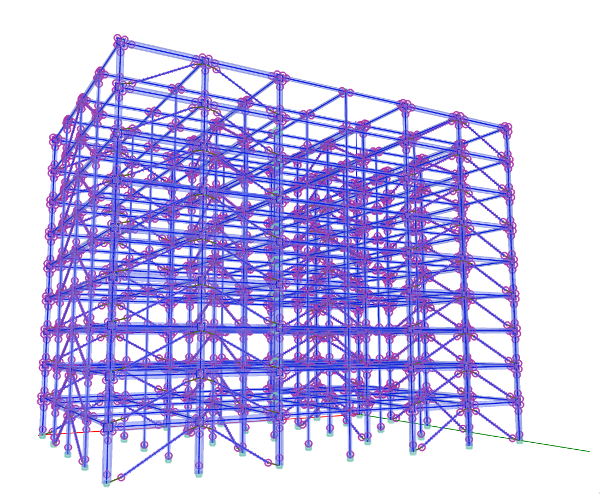

# OpenSees Model Generator

This Python package aims to help users define, analyze, and post-process 3D models using OpenSees. `osmg` is utilizing the Python interpreter of OpenSees. Anyone is free and welcome to use, fork, extend and redistribute the code.

### Documentation

You can access the documentation of this package [here](https://ioannis-vm.github.io/OpenSees_Model_Generator/).

### External resources

- Visit the OpenSees [homepage](https://opensees.berkeley.edu/) to learn more about the program.
- Explore the [OpenSeesWiki](https://opensees.berkeley.edu/wiki/index.php/Main_Page) for additional resources and documentation.
- Find the source code for OpenSeesPy on its [Github repository](https://github.com/zhuminjie/OpenSeesPy).
- Access the OpenSeesPy documentation [here](https://openseespydoc.readthedocs.io/en/latest/).

